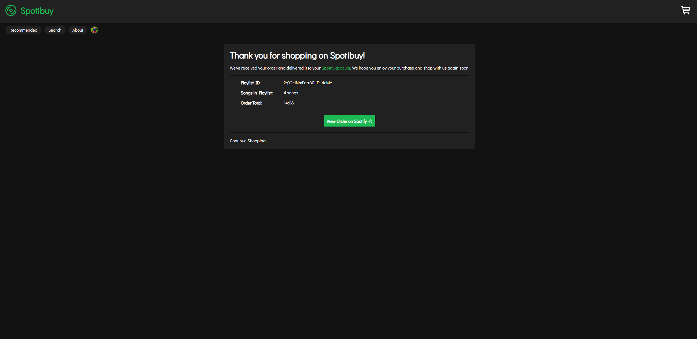

# Spotibuy

"Shop" for Music on Spotify
[Spotibuy Demo Video](https://www.youtube.com/watch?v=J__Z0ytNado 'Spotibuy Demo')

## Project Description:

Spotibuy revolutionizes the way you engage with your Spotify music library by blending the thrill of online shopping with the delight of music discovery. It offers a unique experience where you can browse, add to cart, and "check out" your favorite songs, mimicking the familiar interactions of online shopping platforms.

Spotibuy is powered by Spotify's Web API, leveraging Spotify's vast music library and your listening history to tailor its experience to your preferences. It provides personalized recommendations based on your favorite artists and songs, ensuring that you discover music tailored to your taste.

## How to Install and Run:

### To run locally:

1. clone the repo
2. cd into the repo
3. run "npm install"
4. In vite.config.js, change "'/api': 'https://spotibuy-backend.onrender.com'" to "'/api': 'http://localhost:8000'"
5. In one terminal run npm run dev. In another terminal run npm start.
6. Go to http://localhost:5137

### How to Use the Project:

Visit the Spotibuy website and log in using your Spotify credentials.
Once logged in, start exploring the curated selection of music or search for specific songs or artists.
Add your favorite songs to your "cart" by clicking on the shopping cart icon next to each track.
Review your "cart" and proceed to "check out" to create a playlist with your selected songs.

Spotibuy offers a seamless and enjoyable music shopping experience:

**Explore Music:** Browse through Spotibuy's collection or search for specific songs or artists.

**Add to Cart:** Select your favorite songs by clicking on the shopping cart icon.

**Check Out:** Review your selected songs and proceed to "check out" to create a playlist.

**Enjoy Recommendations:** Discover new music tailored to your taste based on your listening history and preferences.

### Screenshots:

## License:
This project is licensed under the [MIT License](https://opensource.org/licenses/MIT).
